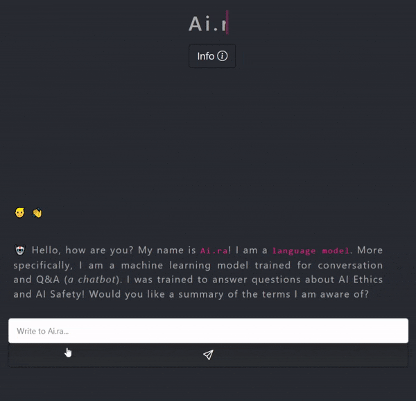

# Aira - the AIRES Expert 🤖

[](https://zenodo.org/badge/latestdoi/499891032)



[`Aira`](https://aires-playground.herokuapp.com/aira) is a `chatbot`. We can also say that `Aira` is a language model, i.e. it is a software application capable of manipulating text. `Aira` is designed to simulate the way a human (expert) would behave during a round of questions and answers (Q&A).

We can classify this type of system (`CUS` - _Conversation Understanding System_) into "_open domain systems_" and "_closed domain systems_". A closed domain system, also known as a domain-specific system, focuses on a particular set of topics and has limited responses. On the other hand, an open domain system could (_in principle_) sustain a dialog about any topic. For example, `GPT-3` - the language model produced by OpenAI - is capable of "_chatting about virtually anything_."

`Aira` is a closed domain chatbot, so don't even try to ask it what the square root of 25 is. It won't be able to help you (but your calculator can!). `Aira` is designed to provide definitions and answer questions on topics related to `artificial intelligence (AI)`, `machine learning`, `AI ethics`, and `AI safety`, and this is her "_domain_".

`Aira` has four iterations, the first and second iterations were trained by machine learning (a `Bayesian neural network`, a `Bi-directional LSTM`, and a `Decoder-Transformer` were trained through `supervised learning`), while the third iteration was created from `pre-set rules` (n-gram analysis + dictionary search). The general development of the `Tf.Keras` models can be found in the `aira_maker` notebook.

In our [demo](https://aires-playground.herokuapp.com/aira), we also provide the possibility to users to conduct conversations with a distilled version of [BlenderBot 3](https://geo-not-available.blenderbot.ai/) (`BB3`). The reason we make this model available in our application is so that people can compare the capabilities of small, closed-domain models (`Aira`) and large language models created for open conversation (`BB3`). More information on `BB3` can be found [here](https://github.com/facebookresearch/ParlAI/blob/main/parlai/zoo/bb3/model_card.md) and in the `information` section of our demo.

Tags and answers are available in this repository. You can change these variables to create your own chatbot if you want. If you have any questions concerning `Aira`, please contact [nicholas@airespucrs.org](mailto:nicholas@airespucrs.org).

If you are not satisfied with `Aira's` performance or would like to help us improve the capabilities of our system, or if you would like to complain about any type of message produced by `Aira`, please contact [nicholas@airespucrs.org](mailto:nicholas@airespucrs.org).

## Cite as 🤗

---

```latex

@misc{nicholas22aira,
  doi = {10.5281/zenodo.6989727},
  url = {https://github.com/Nkluge-correa/Aira-EXPERT},
  author = {Nicholas Kluge Corrêa and Carolina Del Pino},
  title = {Aira - the AIRES Expert},
  year = {2023},
  publisher = {GitHub},
  journal = {GitHub repository},
  note = {Last updated in 28 March 2023},
}

```

Aira was developed by [Nicholas Kluge](https://nkluge-correa.github.io/) and [Carolina Del Pino](http://lattes.cnpq.br/6291330432531578).
